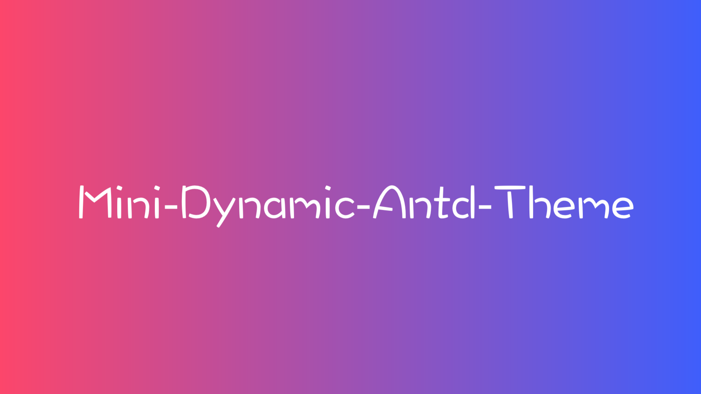
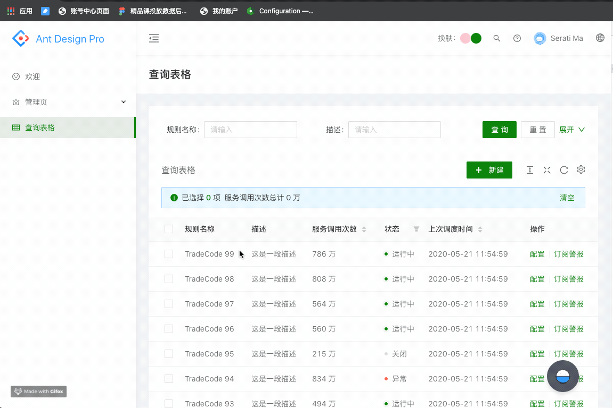
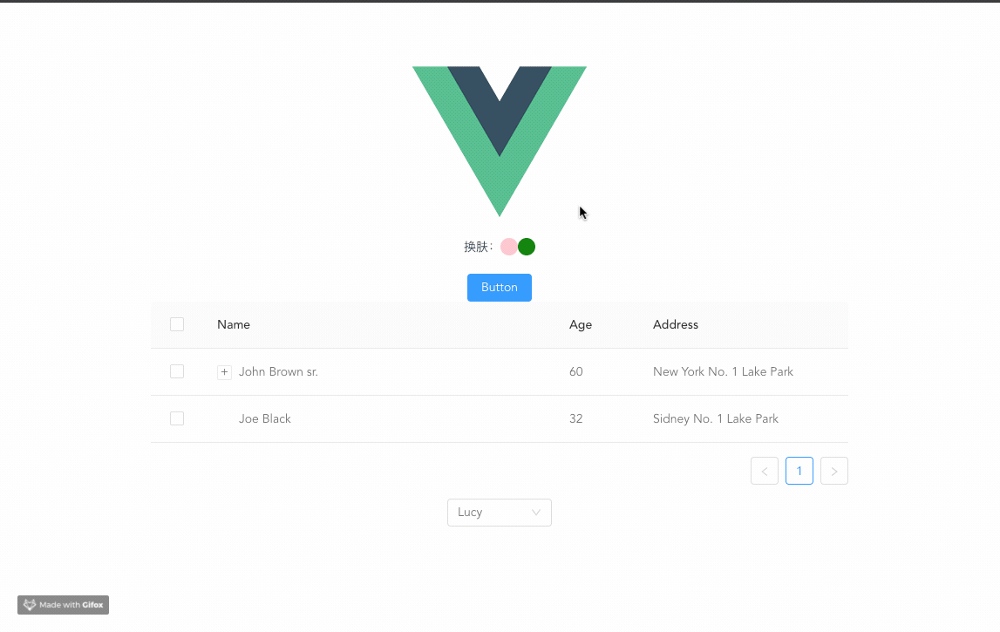

[](https://dynamic-antd-theme-luffyzh.vercel.app/)


[](https://nodei.co/npm/mini-dynamic-antd-theme/)

A simple plugin to dynamic change [ant-design](https://ant.design) || [ant-design-vue](https://www.antdv.com) theme whether less or css.

## 🌍 Browser Support

|  |  |  |  |  |
| --- | --- | --- | --- | --- |
| Chrome 39.0+ ✔ | Edge 12.0+ ✔ | Firefox 30.0+ ✔ | IE 10+ ✔ | Safari 9.1+ ✔ |

## 📦 Install

`npm install mini-dynamic-antd-theme` or `yarn add mini-dynamic-antd-theme`


## 🔨 Usage && 🎆 Effects

### Ant-Design

```
import { changeAntdTheme } from 'mini-dynamic-antd-theme';

<div className={styles.themeContainer}>
  Change theme：
  <span 
    className={styles.theme_color_pink}
    onClick={
      () => changeAntdTheme('pink')
    }
  />
  <span 
    className={styles.theme_color_green}
    onClick={
      () => changeAntdTheme('green')
    }
  />
</div>
```



### Ant-Design-Vue

```
<template>
 <div class="theme-container">
    Change Theme:
    <span @click="changeThemeColor('pink')" class="theme-color-pink" />
    <span @click="changeThemeColor('green')" class="theme-color-green" />
  </div>
</template>

<script>
import { changeAntdTheme } from 'mini-dynamic-antd-theme';

...

export default {
  name: 'App',
  methods: {
    changeThemeColor (color) {
      changeAntdTheme(color)
    }
  }
};

</script>
```


### More Example

#### How to change other element (not ant-design components) color?

The `mini-dynamic-antd-theme` will store the primary-color value in the localStorage named `mini-dynamic-antd-theme-color` after the theme color is changed.

```
// When the theme color has changed， we can change the dom that id = 'header_bar' bg color.

document.getElementById('header_bar').style.backgroundColor
  = window.localStorage.getItem('mini-dynamic-antd-theme-color');

```

## 🌞 Export
| export       | Description         |
| ---------- | ------------ |
| changeAntdTheme   | `param: (color, options)`, change the antd theme. The options specific attributes are as follows： - `storageName`: This can be configured to set storageName when not using picker . - `customCss`: custom Css |


## 🍎 Attention

**This solution is easy to use, so it is prone to problems. We hope you can give us timely feedback. For example, if there is a problem with any component, we will fix the updated version as soon as possible.**

After the version_4.0, `ant-design` has lots of changes. So the plugin could have some problems, you can find and give me a issue. I'll fix it as soon as possible.


## 🌈 More detail u can go to the [dynamic-antd-theme](https://github.com/luffyZh/dynamic-antd-theme)
